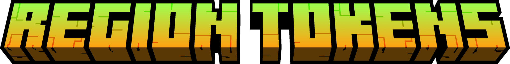

# RegionTokens Plugin



A comprehensive Minecraft plugin that restricts player access to specific regions using time-based tokens. Perfect for protecting farms, arenas, mini-games, and exclusive areas on your server.

## 🎯 Features

- **🗺️ Zone Management**: Define cuboid zones with an intuitive zone selection tool
- **🎫 Token-Based Access**: Players need tokens to enter restricted zones
- **⏱️ Time Tracking**: Token time only counts down while inside the zone
- **📊 Database**: SQLite storage for persistent player data
- **🔌 PlaceholderAPI**: Full integration for custom placeholders
- **🔐 Permission-Based**: Complete permission system for zones and tokens
- **🚫 Anti-Exploit**: Protection against teleporting, dropping tokens, and jumping without tokens
- **⚙️ Reload Command**: Hot-reload configuration without server restart
- **🎨 Customizable Messages**: Fully configurable messages and notifications

## 📋 Requirements

- Java 21+
- Spigot/Paper 1.21.1+
- Gradle (for building from source)

## 🔨 Building

```bash
cd /workspaces/Region-Token-Plugin-Minecraft
gradle build
```

The compiled JAR will be in `build/libs/RegionTokens-1.0.0.jar`

## 📦 Installation

1. Download `RegionTokens-1.0.0.jar` from `build/libs/`
2. Place in your server's `plugins/` folder
3. Restart the server
4. Configuration files will be auto-generated in `plugins/RegionTokens/`

## 🚀 Quick Start

### Step 1: Get the Zone Tool
```
/rgtk tool
```
This gives you shears that act as the zone creation tool.

### Step 2: Create a Zone
1. **Left-click** a block with the tool to set Position 1
2. **Right-click** a block with the tool to set Position 2
3. Run `/rgtk zone create <zoneName>` to create the zone

### Step 3: Create a Token
```
/rgtk token create <tokenName> [duration]
```

Examples:
- `/rgtk token create FarmToken 1h` - 1 hour duration
- `/rgtk token create ArenaToken 30m` - 30 minute duration
- `/rgtk token create VIPToken 2h` - 2 hours duration

**Duration Formats**: `1h`, `30m`, `60s`, `1h30m`, etc.

### Step 4: Assign Token to Zone
```
/rgtk token assign <tokenID> <zoneID>
```

Use these to find IDs:
- `/rgtk zone list` - Lists all zones with IDs
- `/rgtk token list` - Lists all tokens with IDs

### Step 5: Configure Token Item (Optional)
```
/rgtk token item <tokenID> [is-glowing|not-glowing]
```

Give the token to a player:
```
/rgtk token give <playerName> <tokenID>
```

## 📖 Complete Command Reference

### Zone Commands
| Command | Description | Permission |
|---------|-------------|-----------|
| `/rgtk zone create <name>` | Create a new zone | `regiontokens.admin.zones.create` |
| `/rgtk zone list [page]` | List all zones | `regiontokens.admin.zones.list` |
| `/rgtk zone rename <id> <name>` | Rename a zone | `regiontokens.admin.zones.rename` |
| `/rgtk zone kickto <x> <y> <z>` | Set zone kick location | `regiontokens.admin.zones.kickto` |
| `/rgtk zone show <id>` | Display zone boundaries | `regiontokens.admin.zones.list` |
| `/rgtk zone delete <id>` | Delete a zone | `regiontokens.admin.zones.create` |

### Token Commands
| Command | Description | Permission |
|---------|-------------|-----------|
| `/rgtk token create <name> [duration]` | Create a new token | `regiontokens.admin.token.create` |
| `/rgtk token list [page]` | List all tokens | `regiontokens.admin.token.create` |
| `/rgtk token assign <tokenID> <zoneID>` | Assign token to zone | `regiontokens.admin.token.create` |
| `/rgtk token unassign <tokenID> <zoneID>` | Remove token from zone | `regiontokens.admin.token.create` |
| `/rgtk token duration <tokenID> <duration>` | Change token duration | `regiontokens.admin.token.duration` |
| `/rgtk token item <tokenID> [glowing]` | Configure token item | `regiontokens.admin.token.create` |
| `/rgtk token rename <tokenID> <newName>` | Rename a token | `regiontokens.admin.token.create` |
| `/rgtk token lore add <tokenID> <text>` | Add lore line | `regiontokens.admin.token.create` |
| `/rgtk token lore set <tokenID> <line> <text>` | Edit lore line | `regiontokens.admin.token.create` |
| `/rgtk token lore remove <tokenID> <line>` | Remove lore line | `regiontokens.admin.token.create` |
| `/rgtk token give <player> <tokenID>` | Give token to player | `regiontokens.admin.token.create` |
| `/rgtk token delete <tokenID>` | Delete a token | `regiontokens.admin.token.create` |

### Tool Commands
| Command | Description | Permission |
|---------|-------------|-----------|
| `/rgtk tool` | Get the zone selection tool | `regiontokens.admin.tool` |

### System Commands
| Command | Description | Permission |
|---------|-------------|-----------|
| `/rgtk reload` | Reload configuration | `regiontokens.admin.reload` |
| `/rgtk help` | Show help message | None |

## 🔐 Permissions

### Admin Permissions
```
regiontokens.admin.tool                    # Use zone tool
regiontokens.admin.zones.create            # Create/delete zones
regiontokens.admin.zones.list              # List zones
regiontokens.admin.zones.kickto            # Set zone kick location
regiontokens.admin.zones.rename            # Rename zones
regiontokens.admin.token.create            # Create/delete tokens
regiontokens.admin.token.duration          # Change token duration
regiontokens.admin.token.create            # Manage token items
regiontokens.admin.token.create            # Manage token lore
regiontokens.admin.reload                  # Reload plugin
regiontokens.role.admin                    # Admin access to all commands
```

### Player Permissions
```
regiontokens.zones.enter                   # Enter token-restricted zones
regiontokens.zones.bypass.*                # Bypass all zones
regiontokens.zones.bypass.<zoneId>         # Bypass specific zone
regiontokens.token.use.*                   # Use all tokens
regiontokens.token.use.<tokenId>           # Use specific token
```

## 📊 Features in Detail

### Multiple Tokens Per Zone
- Assign multiple tokens to a single zone
- Each token can have different durations
- Players can use any of the assigned tokens to enter

### Token Countdown
- Tokens count down in real-time while inside the zone
- Time displays in token lore (HH:MM:SS format)
- Warning message when time is running low
- Automatic kick when time expires

### Zone Protection
- **Movement Block**: Prevents walking into zones without tokens
- **Teleport Block**: Prevents `/tp` into zones without tokens
- **Fallback Kick**: Kicks players found in zones without valid tokens
- **Item Drop Detection**: Kicks players who drop their tokens
- **Inventory Verification**: Prevents holding tokens without being in zone

### Anti-Exploit Features
- Players cannot stay in zone after dropping tokens
- Teleporting into zone without token is blocked
- Jumping from above into zone triggers automatic kick
- Token time persists if dropped and picked up again
- Bypass permissions for admins to bypass all checks

## 💾 Data Storage

```
plugins/RegionTokens/
├── config.yml                  # Main configuration
├── zones/
│   ├── 1.yml                  # Zone data
│   └── 2.yml                  # Zone data
├── tokens/
│   ├── 1.yml                  # Token data
│   └── 2.yml                  # Token data
└── playerdata.db              # SQLite database (player times)
```

## ⚙️ Configuration

Edit `plugins/RegionTokens/config.yml` to customize:

```yaml
plugin:
  name: "RegionTokens"
  version: "1.0.0"

messages:
  prefix: "&8[&bRegionTokens&8]&r"
  
  zone:
    created:
      title: "&a&lZone Created"
      subtitle: "&6{zoneName} &bsuccessfully created"
    # ... more messages
  
  token:
    created: "{prefix} &eToken created..."
    assigned: "{prefix} &eToken {tokenName} &eassigned..."
    # ... more messages

pagination:
  items-per-page: 5
```

See `config.yml` for all customizable options.

## 🔌 PlaceholderAPI Placeholders

```
%regiontokens_zone%          # Current zone name
%regiontokens_time_left%     # Time remaining in token
%regiontokens_token%         # Current token name
```

## 🛠️ Troubleshooting

### Players can't enter zones
1. Check if player has `regiontokens.zones.enter` permission
2. Verify they have a valid token in inventory
3. Check token duration hasn't expired
4. Ensure token is assigned to the zone

### Tokens not counting down
1. Verify player is actually in the zone
2. Check if time warning threshold is set too high
3. Look for permission issues with `regiontokens.token.use.*`

### Zone creation issues
1. Ensure both positions are set (use `/rgtk tool`)
2. Both positions must be in the same world
3. Position 1 and 2 must be different coordinates

### Database errors
1. Check `playerdata.db` permissions (should be readable/writable)
2. Ensure SQLite is not locked by another process
3. Try deleting the database to regenerate (clears all player times)

## 📝 License

All rights reserved. RegionTokens © 2026

## 🤝 Support

For issues, feature requests, or questions, contact the plugin author.

---

**Version**: 1.0.0  
**Last Updated**: January 28, 2026  
**Java Version**: 21+  
**Minecraft Version**: 1.21.1+
